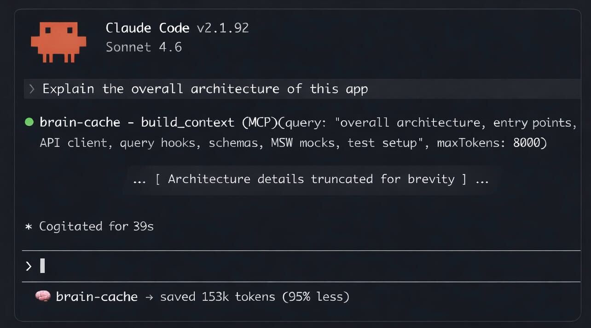

# brain-cache

> Stop sending your entire repo to Claude.

brain-cache is a local AI runtime that sits between your codebase and Claude. It runs embeddings and retrieval on your machine — so Claude only sees what actually matters. Fewer tokens. Better answers. Your API bill stops looking like a mortgage payment.



---

## How it works

1. Embeds your query locally via Ollama (fast, free, no API calls)
2. Retrieves the most relevant code chunks from its local vector index
3. Trims and deduplicates the context to fit a tight token budget
4. Hands Claude a clean, minimal context — not your entire repo

---

## Use inside Claude Code (MCP)

The primary way to use brain-cache is as an MCP server. Run `brain-cache init` once — it auto-configures `.mcp.json` in your project root so Claude Code connects immediately. No manual JSON setup needed.

Claude then has access to:

- **`build_context`** — Assembles relevant context for any question. Use instead of reading files.
- **`search_codebase`** — Finds functions, types, and symbols by meaning, not keyword. Use instead of grep.
- **`index_repo`** — Rebuilds the local vector index.

Also included: **`doctor`** — diagnoses index health and Ollama connectivity.

No copy/pasting code into prompts. No manual file opens. Claude knows where to look.

---

## Quick start

**Step 1: Install**

```
npm install -g brain-cache
```

Or install as a project dev dependency:

```
npm install -D brain-cache
```

**Step 2: Init and index your project**

```
brain-cache init
brain-cache index
```

`brain-cache init` sets up your project: configures `.mcp.json` so Claude Code connects to brain-cache automatically, appends MCP tool instructions to `CLAUDE.md`, installs the brain-cache skill to `.claude/skills/brain-cache/SKILL.md`, installs a status line that shows cumulative token savings, and adds PreToolUse hooks that remind Claude to use brain-cache tools first. Runs once; idempotent.

**Step 3: Use Claude normally**

brain-cache tools are called automatically. You don't change how you work — the context just gets better.

### Daily adoption workflow

Once your first index is built, these daily-use paths are available now:

- `brain-cache index` runs incrementally by default, so unchanged files are skipped on re-index.
- `brain-cache watch [path]` keeps the index in sync with file saves.
- Git history is indexed and surfaced with provenance labels, so retrieval can answer both "what" and "why changed" questions.

> **Advanced:** `init` creates `.mcp.json` automatically. If you need to customise it manually, the expected shape is:
>
> ```json
> {
>   "mcpServers": {
>     "brain-cache": {
>       "command": "brain-cache",
>       "args": ["mcp"]
>     }
>   }
> }
> ```

---

## Install as Claude Code skill

brain-cache ships as a Claude Code skill. After `brain-cache init`, the skill is
installed at `.claude/skills/brain-cache/SKILL.md` in your project. Claude
automatically learns when and how to use brain-cache tools.

To install manually, copy the `.claude/skills/brain-cache/` directory into your
project root.

---

## Status line

After `brain-cache init`, the status line in Claude Code's bottom bar shows your cumulative token savings session by session. You see the reduction without doing anything different.

---

## PreToolUse hooks

`brain-cache init` installs advisory hooks into Claude Code (`~/.claude/settings.json`) that fire before certain tools. They remind Claude to try brain-cache first — but never block execution.

| Tool triggered | Reminder                                                                |
| -------------- | ----------------------------------------------------------------------- |
| Grep           | Try `search_codebase` to find code by meaning instead of regex          |
| Glob           | Try `search_codebase` to locate files by meaning instead of pattern     |
| Read           | Try `build_context` to get relevant code instead of reading whole files |
| Agent          | Try `build_context` or `search_codebase` before spawning a sub-agent    |

Hooks are idempotent — re-running `init` updates brain-cache hooks without touching any other hooks you have configured.

---

## Tuning how much Claude uses brain-cache

`brain-cache init` adds a section to your project's `CLAUDE.md` with clear instructions to use brain-cache tools first. This works well for most users.

If you want to go further, you can strengthen the language yourself. For example:

```
ALWAYS use brain-cache build_context before reading files or using Grep/Glob.
Do not skip brain-cache tools — they return better results with fewer tokens.
```

Or soften it if you prefer Claude to decide on its own. It's your `CLAUDE.md` — edit it to match how you want to work.

---

## CLI commands

The CLI is the setup and admin interface. Use it to init, index, debug, and diagnose — not as the primary interface.

```
brain-cache init                      Initialize brain-cache in a project
brain-cache index                     Build/rebuild the vector index
brain-cache watch [path]              Watch project and run debounced incremental re-index
brain-cache search "auth middleware"  Manual search (useful for debugging)
brain-cache context "auth flow"       Manual context building (useful for debugging)
brain-cache ask "how does auth work?" Direct Claude query via CLI
brain-cache status                    Show index and system status
brain-cache clean                     Remove .brain-cache/ index directories
brain-cache doctor                    Check system health
```

## Requirements

- Node.js >= 22
- Ollama running locally (`nomic-embed-text` model recommended)
- Anthropic API key (for `ask` command only)

---

## If this is useful

Give it a star — or try it on your repo and let me know what breaks.

---

## License

MIT — see LICENSE for details.

---
