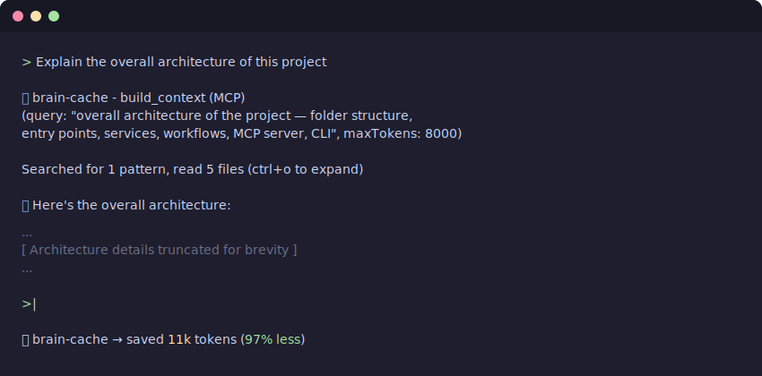

# brain-cache

> Stop sending your entire repo to Claude.

brain-cache is an MCP server that gives Claude local, indexed access to your codebase — so it finds what matters instead of reading everything.

→ ~90% fewer tokens sent to Claude
→ Sharper, grounded answers
→ No data leaves your machine



---

## Use inside Claude Code (MCP)

The primary way to use brain-cache is as an MCP server. Run `brain-cache init` once — it auto-configures `.mcp.json` in your project root so Claude Code connects immediately. No manual JSON setup needed.

Claude then has access to:

- **`build_context`** — Assembles relevant context for any question. Use this instead of reading files.
- **`search_codebase`** — Finds functions, types, and symbols by meaning, not keyword. Use this instead of grep.
- **`index_repo`** — Rebuilds the local vector index.
- **`doctor`** — Diagnoses index health and Ollama connectivity.

No copy/pasting code into prompts. No manual file opens. Claude knows where to look.

---

## ⚡ The problem

When you ask Claude about your codebase, you either:

- paste huge chunks of code ❌
- rely on vague context ❌
- or let tools send way too much ❌

Result:

- worse answers
- hallucinations
- massive token usage

---

## 🧠 How it works

brain-cache is the layer between your codebase and Claude.

1. Your code is indexed locally using Ollama embeddings — nothing leaves your machine
2. When you ask Claude a question, it calls `build_context` or `search_codebase` automatically
3. brain-cache retrieves only the relevant files, trims duplicates, and fits them to a token budget
4. Claude gets tight, useful context — not your entire repo

AI should read the right parts — and nothing else. brain-cache is the layer that makes that possible.

---

## 🔥 Example

```
> "Explain the overall architecture of this project"

brain-cache: context assembled (74 tokens, 97% reduction)

Tokens sent to Claude:     74
Estimated without:         ~2,795
Reduction:                 97%
```

Claude gets only what matters → answers are sharper and grounded.

---

## ⚡ Quick start

**Step 1: Install**

```
npm install -g brain-cache
```

**Step 2: Init and index your project**

```
brain-cache init
brain-cache index
```

`brain-cache init` sets up your project: configures `.mcp.json` so Claude Code connects to brain-cache automatically, and appends MCP tool instructions to `CLAUDE.md`. Runs once; idempotent.

**Step 3: Use Claude normally**

brain-cache tools are called automatically. You don’t change how you work — the context just gets better.

> **Advanced:** `init` creates `.mcp.json` automatically. If you need to customise it manually, the expected shape is:
> ```json
> {
>   "mcpServers": {
>     "brain-cache": {
>       "command": "brain-cache",
>       "args": ["mcp"]
>     }
>   }
> }
> ```

---

## 📊 Optional: Token savings footer

brain-cache returns token usage stats in its tool responses (tokens sent, estimated without, reduction %). By default, Claude decides whether to surface these — no footer is forced.

If you'd like Claude to always show the stats, add this to your project's `CLAUDE.md`:

```
When using brain-cache build_context, include the token savings summary from the response at the end of your answer.
```

This keeps it transparent and under your control.

## 🎛 Tuning how much Claude uses brain-cache

`brain-cache init` adds a section to your project's `CLAUDE.md` with clear instructions to use brain-cache tools first. This works well for most users.

If you want to go further, you can strengthen the language yourself. For example:

```
ALWAYS use brain-cache build_context before reading files or using Grep/Glob.
Do not skip brain-cache tools — they return better results with fewer tokens.
```

Or soften it if you prefer Claude to decide on its own. It's your `CLAUDE.md` — edit it to match how you want to work.

---

## 🧩 Core capabilities

- 🧠 Local embeddings via Ollama — no API calls, no data sent out
- 🔍 Semantic vector search over your codebase
- ✂️ Context trimming and deduplication
- 🎯 Token budget optimisation
- 🤖 MCP server for Claude Code integration
- ⚡ CLI for setup, debugging, and admin

---

## 🧠 Why it’s different

Most AI coding tools:

- send too much context
- hide retrieval behind hosted services
- require you to prompt-engineer your way to good answers

brain-cache is:

- 🏠 Local-first — embeddings run on your machine
- 🔍 Transparent — you can inspect exactly what context gets sent
- 🎯 Token-aware — every call shows the reduction
- ⚙️ Developer-controlled — no vendor lock-in, no cloud dependency

Think: **Vite, but for LLM context.**

---

## 🧪 CLI commands

The CLI is the setup and admin interface. Use it to init, index, debug, and diagnose — not as the primary interface.

```
brain-cache init                      Initialize brain-cache in a project
brain-cache index                     Build/rebuild the vector index
brain-cache search "auth middleware"  Manual search (useful for debugging)
brain-cache context "auth flow"       Manual context building (useful for debugging)
brain-cache ask "how does auth work?" Direct Claude query via CLI
brain-cache doctor                    Check system health
```

---

## 📊 Token savings

Every call shows exactly what was saved:

```
context: 1,240 tokens (93% reduction)
```

Less noise → better reasoning → cheaper usage.

---

## 🧠 Built with GSD

This project uses the GSD (Get Shit Done) framework — an AI-driven workflow for going from idea → research → plan → execution. brain-cache is both a product of that philosophy and a tool that makes it work better: tight context, better outcomes.

---

## ⚠️ Status

Early stage — actively improving:

- ⏳ reranking (planned)
- ⏳ context compression
- ⏳ live indexing (watch mode)

---

## 🛠 Requirements

- Node.js 22+
- Ollama running locally (`nomic-embed-text` model)
- Anthropic API key (for `ask` command only)

---

## ⭐️ If this is useful

Give it a star — or try it on your repo and let me know what breaks.

---

## 📄 License

MIT — see LICENSE for details.

---
